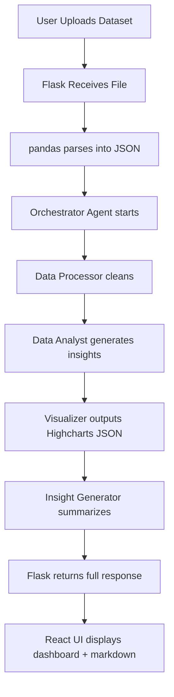

## 📊 AI-Powered Data Insight Platform

A multi-agent system that transforms raw data into **actionable insights and dynamic visualizations**, powered by OpenAI’s new **Agents SDK**, with a Flask backend and a React + Highcharts frontend.

---

## 🧠 Architecture Overview

### 🔧 Backend (Flask + OpenAI Agents SDK)

| Component           | Description                                                                                          |
| ------------------- | ---------------------------------------------------------------------------------------------------- |
| `Flask`             | Web framework handling file uploads and API endpoints.                                               |
| `OpenAI Agents SDK` | Enables orchestrated collaboration between multiple intelligent agents using `gpt-4o` and `o3-mini`. |
| `pandas`            | Reads and parses `.csv`, `.xlsx` files into structured data.                                         |
| `dotenv`            | Loads API keys securely from `.env` file.                                                            |
| `Flask-CORS`        | Allows secure cross-origin requests from the frontend.                                               |

### 🌐 Frontend (React + Highcharts)

| Component        | Description                                                                                                 |
| ---------------- | ----------------------------------------------------------------------------------------------------------- |
| `React.js`       | UI framework used to build interactive views for data upload, AI-generated insights, and visual dashboards. |
| `Highcharts.js`  | Renders visually rich, interactive data visualizations as JSON configs returned by the backend agents.      |
| `react-dropzone` | Enables drag-and-drop uploads for files.                                                                    |

---

## 🧩 Agents & Roles (OpenAI SDK)

| Agent                 | Model     | Responsibilities                                                                                         |
| --------------------- | --------- | -------------------------------------------------------------------------------------------------------- |
| **Data Processor**    | `gpt-4o`  | Cleans and preprocesses the uploaded dataset: removes duplicates, fixes formats, handles missing values. |
| **Data Analyst**      | `gpt-4o`  | Analyzes structured data, finds trends, patterns, anomalies, and returns structured findings.            |
| **Visualization**     | `o3-mini` | Transforms analysis into **Highcharts JSON** configurations (bar, pie, column, line, etc.).              |
| **Insight Generator** | `gpt-4o`  | Synthesizes insights and produces **Markdown summaries** with strategic recommendations.                 |
| **Orchestrator**      | `gpt-4o`  | Coordinates handoffs between all agents, manages execution pipeline.                                     |

---

## 🔁 App Logic Flow



---

## 📁 Folder Structure

```
bi_analyst/
├── backend/
│   ├── app.py
│   ├── .env
│   ├── orchestrator/
│   │   └── workflow.py
│   ├── agents/
│   │   ├── __init__.py
│   │   ├── data_processor.py
│   │   ├── data_analyst.py
│   │   ├── visualization.py
│   │   └── insight_generator.py
├── frontend/
│   ├── src/
│   │   ├── components/
│   │   │   ├── Uploader.jsx
│   │   │   ├── Dashboard.jsx
│   │   │   ├── ChatInputWidget.jsx
│   │   │   └── InsightPane.jsx
│   │   └── App.js
├── uploads/
├── README.md
```

---

## 🚀 Setup Instructions

### 1. Backend

```bash
cd backend
python -m venv venv
source venv/bin/activate   # or venv\\Scripts\\activate on Windows
pip install -r requirements.txt
```

📄 `.env` file:

```env
OPENAI_API_KEY=sk-xxx
```

Run the backend:

```bash
python app.py
```

### 2. Frontend

```bash
cd frontend
npm install
npm start
```

Ensure `proxy` is set in `frontend/package.json`:

```json
"proxy": "http://127.0.0.1:5050"
```

---

## 📬 Endpoints

| Route     | Method | Description                                                                          |
| --------- | ------ | ------------------------------------------------------------------------------------ |
| `/upload` | POST   | Uploads and processes a `.csv` or `.xlsx` dataset using the multi-agent AI pipeline. |
| `/chat`   | POST   | Sends a follow-up question and receives new AI-generated markdown insights.          |

---

## 🛡️ Error Handling

* Internal errors (500) log full tracebacks in the Flask terminal.
* Frontend receives JSON error messages for display.

---

## 🌍 Technologies Used

* **Python 3.11+**
* **Flask**
* **OpenAI Agents SDK** (May 2025)
* **React.js**
* **Highcharts.js**
* **pandas**
* **asyncio + event loop handling**

---

## ✨ Future Enhancements

* Multi-language support (English / Arabic)
* OAuth login for dataset privacy
* Insights download as PDF or Word
* Integration with database (PostgreSQL or MongoDB)

---

## 📜 License

MIT License. © Mohammed Bahageel 2025


